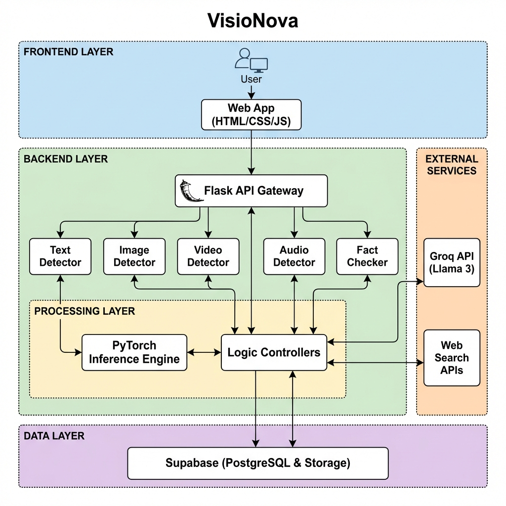

# VisioNova System Architecture

## Overview

VisioNova is a **multi-modal AI credibility engine** designed to verify the authenticity of digital media and detect misinformation. The system analyzes five types of content: **images, videos, audio, text, and factual claims**.

---

## System Layers

### Layer 1: User Interface (Frontend)

The frontend is built with vanilla HTML5, CSS3, and JavaScript. Users navigate through a single-page flow:

```
Homepage → Analysis Dashboard → [Media Result Pages] → Report Page
```

**Pages:**
| Page | Purpose |
|------|---------|
| `homepage.html` | Landing page with feature overview |
| `AnalysisDashboard.html` | Central hub for uploading/analyzing media |
| `ResultPage.html` | Image analysis results |
| `VideoResultPage.html` | Video/deepfake detection results |
| `AudioResultPage.html` | Audio forensics results |
| `TextResultPage.html` | AI text detection results |
| `FactCheckPage.html` | Claim verification interface |
| `ReportPage.html` | Export and share analysis reports |

---

### Layer 2: Backend API (Flask Server)

The backend is a Python Flask application (`app.py`) that exposes REST API endpoints. It routes requests to specialized detection modules.

**API Endpoints:**
| Method | Endpoint | Purpose |
|--------|----------|---------|
| `GET` | `/` | Health check & system status |
| `POST` | `/api/detect-image` | Analyze uploaded image |
| `POST` | `/api/detect-video` | Analyze uploaded video |
| `POST` | `/api/detect-audio` | Analyze uploaded audio |
| `POST` | `/api/detect-ai` | Detect AI-generated text |
| `POST` | `/api/detect-ai/upload` | Analyze PDF/DOCX documents |
| `POST` | `/api/fact-check` | Verify a claim or URL |
| `POST` | `/api/deep-fact-check` | Enhanced multi-query fact-check |
| `POST` | `/api/feedback` | Submit user feedback on results |

---

### Layer 3: Detection Modules

#### 1. Image Detector Module

Detects AI-generated images and manipulations.

| Component | Function |
|-----------|----------|
| **AI Image Detection** | Identifies images created by GANs (StyleGAN, MidJourney) or diffusion models (DALL-E, Stable Diffusion) using CNN classifiers |
| **Error Level Analysis (ELA)** | Detects JPEG compression inconsistencies that indicate splicing or editing |
| **Metadata Forensics** | Analyzes EXIF data for timestamp anomalies, missing camera info, or editing software traces |
| **Reverse Image Search** | Cross-references against known databases to find original sources |

**Output:** Authenticity score (0-100), manipulation heatmap, metadata report

---

#### 2. Video Detector Module

Detects deepfakes and synthetic video content.

| Component | Function |
|-----------|----------|
| **Deepfake Detection** | Uses face-swap detection models (XceptionNet, EfficientNet) to identify synthetic faces |
| **Frame-by-Frame Analysis** | Extracts keyframes and analyzes temporal consistency |
| **Facial Landmark Detection** | Tracks 68 facial landmarks to detect unnatural movements |
| **Lip-Sync Verification** | Compares audio waveform with lip movements to detect audio-visual mismatches |
| **Motion Consistency Check** | Verifies that physical movements obey natural laws (gravity, inertia) |

**Output:** Deepfake probability, suspicious frame timestamps, facial analysis visualization

---

#### 3. Audio Detector Module

Detects AI-generated voice and synthetic audio.

| Component | Function |
|-----------|----------|
| **Voice Clone Detection** | Identifies synthetic vocal patterns from TTS systems (ElevenLabs, VALL-E, Bark) |
| **Spectral Analysis** | Examines frequency distribution using spectrograms to find anomalies typical of AI audio |
| **TTS Pattern Recognition** | Detects artifacts like unnatural pauses, monotonic pitch, or robotic inflection |
| **Frequency Anomaly Detection** | Identifies missing harmonics or unusual frequency cutoffs from audio synthesis |

**Output:** Authenticity score, spectrogram visualization, detected anomalies list

---

#### 4. Text Detector Module *(Implemented)*

Distinguishes between human-written and AI-generated text.

| Component | File | Function |
|-----------|------|----------|
| **ML Detector** | `detector.py` | DistilBERT-based classifier trained on human vs AI text |
| **Document Parser** | `document_parser.py` | Extracts text from PDF, DOCX, and TXT files |
| **Perplexity Analysis** | (in detector) | Measures text predictability - low perplexity suggests AI origin |
| **Burstiness Analysis** | (in detector) | Measures sentence length variance - uniform = likely AI |
| **Explainer** | `explainer.py` | Generates LLM-powered explanations of detection results |

**Output:** AI probability (0-100), human probability, perplexity chart, burstiness graph, explanation

---

#### 5. Fact Check Module *(Implemented)*

Verifies factual claims against trusted sources.

| Component | File | Function |
|-----------|------|----------|
| **Input Classifier** | `input_classifier.py` | Determines if input is a URL, claim, or question |
| **Content Extractor** | `content_extractor.py` | Scrapes and cleans web page content with retry logic |
| **Temporal Analyzer** | `temporal_analyzer.py` | Detects time context (historical dates vs. current events) |
| **Web Searcher** | `web_searcher.py` | Queries search APIs for corroborating/contradicting sources |
| **Credibility Manager** | `credibility_manager.py` | Rates source trustworthiness using 70+ pre-rated domains |
| **Fact Checker** | `fact_checker.py` | Synthesizes verdict using LLM reasoning |

**Output:** Verdict (TRUE/FALSE/UNVERIFIED), confidence score, supporting sources, explanation

---

### Layer 4: External Services

| Service | Purpose |
|---------|---------|
| **Groq API (Llama 3)** | LLM for generating explanations, synthesizing verdicts, and reasoning |
| **Web Search APIs** | Fetching corroborating sources for fact-checking |
| **OpenCV** | Image and video frame processing |
| **Librosa** | Audio signal processing and spectral analysis |

---

### Layer 5: Storage

| Storage | Purpose |
|---------|---------|
| **ML Model Checkpoints** | Trained model weights for each detector |
| **Training Datasets** | Human/AI text datasets for model training |
| **source_credibility.json** | Database of 70+ domain trust ratings |
| **Feedback Logs** | User-submitted corrections for model improvement |

---

## Data Flow Summary



---

## Technology Stack

| Layer | Technology |
|-------|------------|
| **Frontend** | HTML5, CSS3, JavaScript (vanilla) |
| **API Server** | Python 3.10+, Flask, Flask-CORS, Flask-Limiter |
| **ML/Deep Learning** | PyTorch, Transformers (DistilBERT, XceptionNet) |
| **LLM Integration** | Groq API (Llama 3.3 70B) |
| **Image Processing** | OpenCV, Pillow |
| **Audio Processing** | Librosa, NumPy |
| **Video Processing** | OpenCV, FFmpeg |
| **Web Scraping** | BeautifulSoup, requests |
| **Document Parsing** | PyPDF2, python-docx |

---

## Implementation Status

| Module | Status | Notes |
|--------|--------|-------|
| Text Detection | ✅ Complete | ML model trained, API working |
| Fact Checking | ✅ Complete | Full pipeline with LLM synthesis |
| Image Detection | 🔲 Planned | Frontend ready, backend pending |
| Video Detection | 🔲 Planned | Frontend ready, backend pending |
| Audio Detection | 🔲 Planned | Frontend ready, backend pending |
